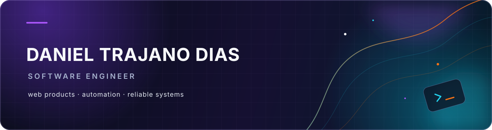
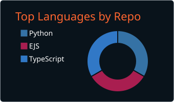

  

  <a href="./README.en.md">Read in English</a>
  &nbsp;·&nbsp;
  <a href="https://www.linkedin.com/in/danieltrajanod/">LinkedIn</a>
  &nbsp;·&nbsp;
  <a href="mailto:daniel@trajano.dev.br>E-mail</a>

<h1 align="center">Seja bem vindo ao meu perfil!.</h1>

  Construo produtos web, ferramentas de automação e fluxos confiáveis. 
  Rio de Janeiro, Brasil.

  
  
  

## O que construo

- Produtos que transformam trabalho operacional em fluxos claros.
- Automações que removem etapas repetitivas e facilitam decisões.
- Sistemas full stack com qualidade e sólidos para dados, acesso e entrega.

## Projetos em destaque

<table>
  <tr>
    <td width="50%" valign="top">
      <h3><a href="https://github.com/dtdias/status-board">Status Board</a></h3>
      
Transforma o trabalho operacional semanal em relatórios PPTX claros, editáveis e versionados.

      
<code>Next.js</code> <code>TypeScript</code> <code>Supabase</code> <code>PostgreSQL</code>

      <a href="https://statusboard.trajano.dev.br/login">Abrir projeto</a>
    </td>
    <td width="50%" valign="top">
      <h3><a href="https://github.com/dtdias/BidInAction">BidInAction</a></h3>
      
Ferramenta desktop para filtrar leilões de joias no portal de leilões da Caixa.

      
<code>Python</code> <code>PySide6</code> <code>Requests</code>

      <a href="https://github.com/dtdias/BidInAction">Ver repositório</a>
    </td>
  </tr>
  <tr>
    <td width="50%" valign="top">
      <h3><a href="https://github.com/dtdias/find-engineering-price">Find Engineering Price</a></h3>
      
Projeto de ambiente de desenvolvimento explorando ferramentas e automação de aplicações.

      
<code>EJS</code> <code>JavaScript</code> <code>Docker</code>

      <a href="https://github.com/dtdias/find-engineering-price">Ver repositório</a>
    </td>
    <td width="50%" valign="top">
      <h3>Agora</h3>
      
Construindo software prático com equilíbrio entre visão de produto, interfaces limpas e engenharia confiável.

      
<code>Construir</code> <code>Aprender</code> <code>Melhorar</code>

    </td>
  </tr>
</table>

## Ferramentas

  
  
  
  
  

  
  
  
  
  

## Atividade no GitHub

  
  
  

  

## Contato

  <a href="https://www.linkedin.com/in/danieltrajanod/">LinkedIn</a> ·
  <a href="mailto:danieltrajano.d@gmail.com">daniel@trajano.dev.br</a>

Aberto a boas conversas sobre software, produtos e engenharia.

