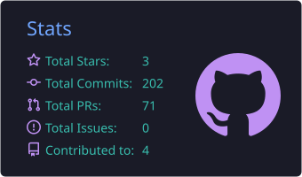
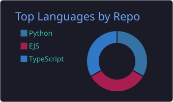
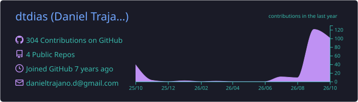

  

  <a href="./README.pt-BR.md">Leia em português</a>
  &nbsp;·&nbsp;
  <a href="https://www.linkedin.com/in/danieltrajanod/">LinkedIn</a>
  &nbsp;·&nbsp;
  <a href="mailto:danieltrajano.d@gmail.com">Email</a>

<h1 align="center">Software Engineer building useful things.</h1>

  I design and build web products, automation tools, and reliable workflows. 
  Based in Rio de Janeiro, Brazil.

  
  
  

## What I build

- Product experiences that turn messy operational work into clear workflows.
- Automation that removes repetitive steps and makes decisions easier.
- Full-stack systems with strong boundaries around data, access, and delivery.

## Featured work

<table>
  <tr>
    <td width="50%" valign="top">
      <h3><a href="https://github.com/dtdias/status-board">Status Board</a></h3>
      
Turns weekly operational work into clear, editable, versioned PPTX reports.

      
<code>Next.js</code> <code>TypeScript</code> <code>Supabase</code> <code>PostgreSQL</code>

      <a href="https://statusboard.trajano.dev.br/login">Open project</a>
    </td>
    <td width="50%" valign="top">
      <h3><a href="https://github.com/dtdias/BidInAction">BidInAction</a></h3>
      
Desktop tool for filtering jewelry auctions from the Caixa auction portal.

      
<code>Python</code> <code>PySide6</code> <code>Requests</code>

      <a href="https://github.com/dtdias/BidInAction">View repository</a>
    </td>
  </tr>
  <tr>
    <td width="50%" valign="top">
      <h3><a href="https://github.com/dtdias/find-engineering-price">Find Engineering Price</a></h3>
      
Development environment project exploring application tooling and automation.

      
<code>EJS</code> <code>JavaScript</code> <code>Docker</code>

      <a href="https://github.com/dtdias/find-engineering-price">View repository</a>
    </td>
    <td width="50%" valign="top">
      <h3>Now</h3>
      
Shaping practical software with a balance of product thinking, clean interfaces, and dependable engineering.

      
<code>Build</code> <code>Learn</code> <code>Improve</code>

    </td>
  </tr>
</table>

## Toolbox

  

## GitHub activity

  
  

  

## Connect

  <a href="https://www.linkedin.com/in/danieltrajanod/">LinkedIn</a> ·
  <a href="mailto:danieltrajano.d@gmail.com">danieltrajano.d@gmail.com</a>

Open to thoughtful conversations about software, products, and engineering.

